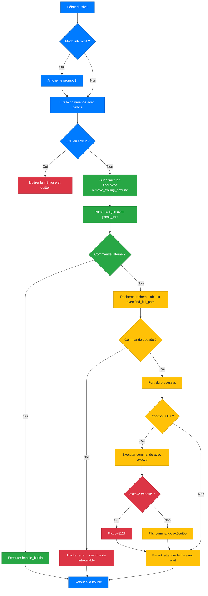

# 💻🧠 Projet : Simple Shell


## 🧑‍💻 Auteurs

- Kevin Fresne https://github.com/GuarickGit
- Sanoussy Fofana https://github.com/samamtro

---

## 📖 Sommaire

1. Introduction
2. Objectif du projet
3. Flowchart
4. Arborescence du projet
5. Compilation / Man page
6. Exemples et sorties
7. Liste des fonctions
8. Contraintes
9. Sources / Références

## 1️⃣ Introduction

Ce projet s’inscrit dans le cadre de la formation Holberton et a pour objectif de recréer un shell Unix basique, en langage C. Il s’agit d’un mini-interpréteur de commandes, capable d’exécuter des programmes, gérer les commandes internes, les chemins, et de respecter un comportement identique à /bin/sh pour les cas standards.

## 2️⃣ Objectif du projet

- Reproduire un shell minimaliste en C, similaire à /bin/sh.

- Gérer les modes interactif et non-interactif (exécution depuis pipe ou fichier).

- Lire l’entrée utilisateur, parser la commande, et exécuter via execve.

- Implémenter des builtins comme exit et env.

- Gérer les erreurs comme un shell Unix standard (affichage avec perror, code 127...).

- Rechercher les commandes à exécuter dans les chemins du $PATH.

- Éviter toute fuite de mémoire, via une gestion rigoureuse.

- Respecter la norme Betty, limiter à 5 fonctions par fichier.

- Utiliser uniquement les fonctions système autorisées par le projet.

- Structurer un projet en C de manière claire, modulaire et évolutive.

## 3️⃣ Flowchart


## 4️⃣ Arborescence du projet

```
/holbertonschool-simple_shell
│
├── AUTHORS
├── builtins.c
├── execute.c
├── handle_path.c
├── main.c
├── main.h
├── man_1_simple_shell
├── parse_input.c
├── README.md
└── utils.c
```

## 5️⃣ Compilation / Man page

```bash
gcc -Wall -Werror -Wextra -pedantic -std=gnu89 *.c -o hsh
```
```bash
man ./man_1_simple_shell
```

## 6️⃣ Exemples

### Exemple mode interactif
```bash
$ ./hsh
$ ls
AUTHORS  builtins.c  execute.c  handle_path.c  main.c  main.h  man_1_simple_shell  parse_input.c  README.md  utils.c
$ echo Hello Axel, my Favorite SWE !
Hello Axel, my Favorite SWE !
$ exit
```
### Exemple non-interactif
```bash
$ echo "ls" | ./hsh
AUTHORS  builtins.c  execute.c  handle_path.c  main.c  main.h  man_1_simple_shell  parse_input.c  README.md  utils.c
```
```bash
$ echo "echo Hello Axel, my Favorite SWE !" | ./hsh
Hello Axel, my Favorite SWE !
```

## 7️⃣ Liste des fonctions

| Fichier         | Fonction                   | Rôle / Description |
|-----------------|----------------------------|--------------------|
| `main.c`        | `main`                     | Point d’entrée du programme. Initialise et lance la boucle principale. |
| `main.c`        | `shell_loop`               | Boucle principale du shell. Gère le prompt, la lecture et l'exécution. |
| `main.c`        | `remove_trailing_newline`  | Supprime le `\n` en fin de ligne entrée. |
| `builtins.c`    | `handle_builtin`           | Exécute les commandes internes (`exit`, `env`). |
| `execute.c`     | `execute_command`          | Fork puis exécution de la commande via `execve`, attente avec `wait()`. |
| `parse_input.c` | `parse_line`               | Découpe la ligne utilisateur en arguments (commande + args). |
| `handle_path.c` | `find_full_path`           | Recherche du chemin absolu de la commande à exécuter via `$PATH`. |
| `utils.c`       | `get_path_from_env`        | Récupère la valeur de `$PATH` depuis les variables d’environnement. |
| `utils.c`       | `_realloc_args`            | Réalloue dynamiquement le tableau d'arguments (`args[]`). |

## 8️⃣ Contraintes

- Respect strict de la **norme Betty**
- Pas plus de **5 fonctions par fichier source**.
- **Aucune fuite mémoire**.
- Le shell doit :
  - Fonctionner en **mode interactif** (affichage du prompt `$`).
  - Fonctionner en **mode non-interactif** (entrée via pipe ou fichier).
- Le comportement doit être **identique à `/bin/sh`** :
  - Même format d’erreur, sauf pour le nom du programme (`argv[0]`).
  - Affichage de l’erreur standard, par exemple :
  ```
    $ echo "qwerty" | ./hsh
    ./hsh: 1: qwerty: not found
    ```
- **Utiliser uniquement les appels système et fonctions autorisés**, à savoir :

  - **Fonctions de `string.h`**
  - `access` (man 2 access)
  - `chdir` (man 2 chdir)
  - `close` (man 2 close)
  - `closedir` (man 3 closedir)
  - `execve` (man 2 execve)
  - `exit` (man 3 exit)
  - `_exit` (man 2 _exit)
  - `fflush` (man 3 fflush)
  - `fork` (man 2 fork)
  - `free` (man 3 free)
  - `getcwd` (man 3 getcwd)
  - `getline` (man 3 getline)
  - `getpid` (man 2 getpid)
  - `isatty` (man 3 isatty)
  - `kill` (man 2 kill)
  - `malloc` (man 3 malloc)
  - `open` (man 2 open)
  - `opendir` (man 3 opendir)
  - `perror` (man 3 perror)
  - `printf`, `fprintf`, `vfprintf`, `sprintf` (man 3)
  - `putchar` (man 3 putchar)
  - `read` (man 2 read)
  - `readdir` (man 3 readdir)
  - `signal` (man 2 signal)
  - `stat` / `__xstat`, `lstat` / `__lxstat`, `fstat` / `__fxstat` (man 2)
  - `strtok` (man 3 strtok)
  - `wait`, `waitpid`, `wait3`, `wait4` (man 2)
  - `write` (man 2 write)

## 9️⃣🔗 Sources / Références

- Documentation officielle des appels systèmes (`man 2`, `man 3`)
- Cours et projets de la formation **Holberton School**
- Page de manuel de `sh` et tests avec `/bin/sh`
- ChatGPT
- Outils utilisés :
  - `valgrind` pour la détection de fuites mémoire
  - `gcc` avec les options strictes recommandées
